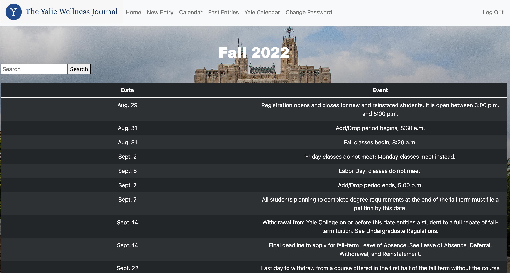

# The Yalie Wellness Journal

## How to run:
* Download the journal.zip file and upload its contents to CodeHS
* In the terminal window, run “pip install pytz” to download pytz, which is used to get timezone
* In the terminal window, run "pip install -r requirements.txt" to download the requirements for the project
* In the terminal window, type "cd journal" to enter the project folder
* Type "flask run" in the terminal window and click on the link that appears. You should be directed to the website log in page.

## Create an Account:
* Click on the Register button (found in the navigation bar) to create an account for yourself
* Enter the information requested and click submit
! Note that if you enter missing or incorrect information (i.e. two passwords do not match), you will get error messages from Handsome Dan
* Once you register with all the requested information, you will be automatically signed in to your account.

## Start using the Yalie Wellness Journal:
* The first page that you will see after registering is the home page, which includes:
	* An appropriate greeting based on the time of the day (good morning, good afternoon, or good night), including your name
	* The time, which is displayed using the time and datetime modules
	* A random quote picked from a database of 200 quotes (see the quotes database inside journal.db)

## New Entry:
* To enter a new journal entry, click on "New Entry" on the Navigation Bar
* There, you will see that the first question asks for the date of the entry. Press today if you want to use today's date
* Answer all questions, including the one that prompts you to ask an original prompt to yourself. Do not forget to answer the original prompt too.
* Lastly, rate your day on a scale of 1-5, and submit your entry

## Past Entries:
* To see all of your past entries, click on the Past Entries button in the Navigation Bar
* Note that if you do not have any entries, you will receive an error message from Handsome Dan
* If you do have entries already, you will see a table displaying all of your entries ordered by the dates they were entered.

## Yale Calendar:
* Click on the Yale Calendar button in the Navigation Bar to see important dates for Fall 2022 and Spring 2023 from Yale's academic calendar. This information has been pulled directly from Yale's academic calendar website and converted to a SQL table (see yale_calendar inside journal.db).
* Search Function: To search an event from the long list of events, type the keywords you would like to search in the search box.
	* Please do not click on the "Search Button," as the information will be filtered dynamically as you type.
	* To go back to the unfiltered table, delete your input on the search box and click on the Search button

## Change Password:
* To change your password, click on the Change Password button on the Navigation Bar.
* Answer all the questions asked correctly
	* Note that if you type incorrect answers, you will get an error message from Handsome Dan
* Once you type all the information, click on the Submit button. Do not forget to use your new password the next time(s) you sign in.

## Calendar:
* The default view of the calendar displays and highlights today's date.
* You can navigate to other months by using the arrows on the right and left sides of top label marking the month and the year. You can also make use of the search bar located in the bottom left corner of the calendar, typing the month and year in mm/yyyy format, if you type the correct numbers, the programme itself formats it in this format.
* If you have navigated to another month or year, you can easily come back to today by clicking on the today button on the bottom right corner of the calendar.
* To view events for each day, you can click on the date, which will open up a list of events for that day on the right side of the calendar.
* To add events, simply click on the plus sign at the bottom right side of the screen, which will allow you to enter event title and the time frame for the event. The programme limits event titles to 50 characters and checks that time entries are in the correct format indicating a valid time. If the user does not follow these expectations, an error message pops up in the screen as an alert.
* Once an event ends, the user can simply click on it with the tick appearing at the right side, to check the event as done and make it dissapear.
* The programme stores the events you have entered in the localStorage, which prevents you from losing event data unless you intentionally delete any.
* To go back to home page, simply click the back arrow in your browser.

